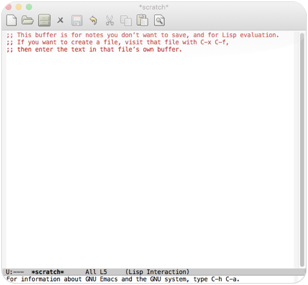

> Please reproduce this issue in `emacs -Q`.

This is a sentence you will often read when you report bugs in Emacs packages;
it's often a quick reply from a developer and goes with no further explanation
or even the slightest clue on what you’re supposed to do.  If you ever found
yourself in that situation then this post is for you: I’ll explain what it means
to “reproduce a bug in `emacs -Q`”, how to do that properly, and why developers
ask you for this.

<!--more-->

## How do you reproduce a bug in emacs -Q? ##

`emacs -Q` provides a “pure” Emacs session which loads no packages and
absolutely no configuration files[^fn-1].

To start one open a terminal window and type `emacs -Q`.  On OS X use the
slightly more convoluted command `open --new -a Emacs.app --args -Q` to start a
fresh GUI Emacs.  You get a bare-bones Emacs that looks like this:

Now initialise Emacs’ package system with `M-x package-initialize`.  Normally
this happens in your init file but since `emacs -Q` doesn’t load it you need to
do that explicitly.  If you omit this step you can’t access your installed
packages in `emacs -Q` so it’s a pretty important one.

On OS X you should also run `M-x exec-path-from-shell-initialize` now, provided
that you installed [exec-path-from-shell][] in your Emacs.  This ensures that
your `$PATH` in Emacs is correct, i.e. that you have access to the same
executables as in your terminal.

Eventually enable the buggy package by following its setup instructions. You
should now manually execute the commands that you copied to your init file when
you installed the package in your Emacs.  For instance, if you’d like to
reproduce a bug in [Flycheck][] you should now type `M-x global-flycheck-mode`
to enable Flycheck.

Now you’re ready to reproduce the bug, simply by following the same steps that
triggered the bug in your normal Emacs session.  For instance, if you’d like to
show a broken syntax checker in Flycheck visit the same file that triggered the
bug in your normal Emacs session.

While following these steps please take notes about the commands that you run,
the keys that you type and the things that you do to reproduce the bug, and
include these notes in your bug report.

## Why do developers ask for this? ##

As package developers we ask you to reproduce a bug in this session because
it’s an essential first step to pin down the bug.

Emacs provides absolutely *no isolation* between all the packages that are
loaded in your normal Emacs session.  This is blessing and curse at the same
time: It allows you to customise almost everything in Emacs but a single faulty
package can break down your entire Emacs session.  We can’t tell if the bug that
you reported to us is really a bug in our own package or if there is another
buggy or misbehaving package in your Emacs configuration that breaks our
package.

If you can reproduce a bug in `emacs -Q` you give us an important clue: The bug
is in our own code and we only need to look at our own code to find it.  That is
much simpler than looking at your *entire* Emacs configuration and all the other
packages that you have installed.  What’s more you also enable us to reproduce
the bug *ourselves* with just our package and a pure Emacs session, and if we
can reproduce a bug [we are halfway to fixing it][good-reports].

[good-reports]: https://geoff.greer.fm/2015/08/15/how-to-write-good-bug-reports/
[exec-path-from-shell]: https://github.com/purcell/exec-path-from-shell
[flycheck]: https://www.flycheck.org

[^fn-1]: There is also `emacs -q` which will make Emacs ignore your init file
    (e.g. `~/.emacs` or `~/.emacs.d/init.el`) and packages that you installed
    with the built-in packages, but still load code from the global Emacs site
    which includes Emacs extensions that you installed with the
    system’s package manager (e.g. `apt-get`).  As such this option is
    insufficient to reproduce bugs because there may still be packages that
    infer.
